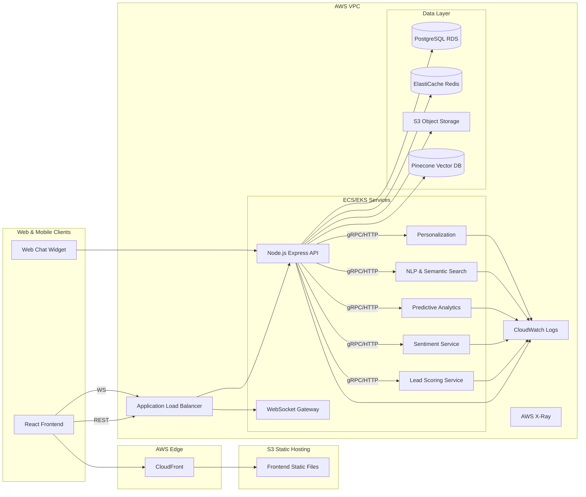

# CliniGlobal AI-Powered CRM

CliniGlobal is a production-grade, AI-powered CRM tailored for healthcare and clinical sectors. It provides secure, scalable, and HIPAA/GDPR-aligned capabilities for lead management, sales pipelines, conversational AI, predictive analytics, and automated marketing.

## Key Capabilities
- Role-based access control (Admin, Sales, Support, Marketing)
- OAuth2/JWT auth with optional MFA (TOTP)
- AI Lead Scoring & Prediction (Python microservices)
- Conversational AI (web chatbot + WhatsApp via Twilio)
- Sentiment analysis of communications
- Predictive sales and churn analytics
- Automated email & marketing campaign generation (OpenAI + SendGrid)
- Smart workflow automation and rules engine
- AI dashboards and export to PDF/Excel
- Natural language semantic search (Pinecone)
- Voice-to-CRM notes (ASR transcription)
- Real-time updates (WebSocket)

## System Architecture



## Repos & Structure
```
frontend/           React + Vite + TS
backend/            Node.js + Express + TS
ai-services/        FastAPI microservices (lead_scoring, sentiment, predictive, nlp, personalization)
  common/           Shared utils (token verification, schemas)
  data/             Sample datasets
  models/           Trained model artifacts
  scripts/          Training scripts

db/                 SQL schema, seeds
deploy/             Docker, Terraform (ECS/EKS, RDS), GitHub Actions
scripts/            Utilities for local dev
```

## Local Development
- Prereqs: Docker, Node 20+, Python 3.10+
- Copy `.env.example` to `.env` files per service and set values
- Run: `docker compose up --build`

## Security & Compliance
- TLS termination via ALB/CloudFront
- JWT + OAuth2 with short-lived access tokens, refresh tokens, and optional MFA
- RBAC enforced via middleware
- PII encryption using AES-256 at app layer + pgcrypto in Postgres
- Audit logging and immutable trails
- Data retention, deletion, consent tracking for GDPR
- BAA alignment and minimal PHI handling

## CI/CD
- GitHub Actions builds, tests, SAST, pushes images to ECR, deploys with Terraform
- Blue/green or rolling deploys on ECS/EKS

## Documentation
- See `docs/architecture.md` and `db/schema.sql` for ERD.