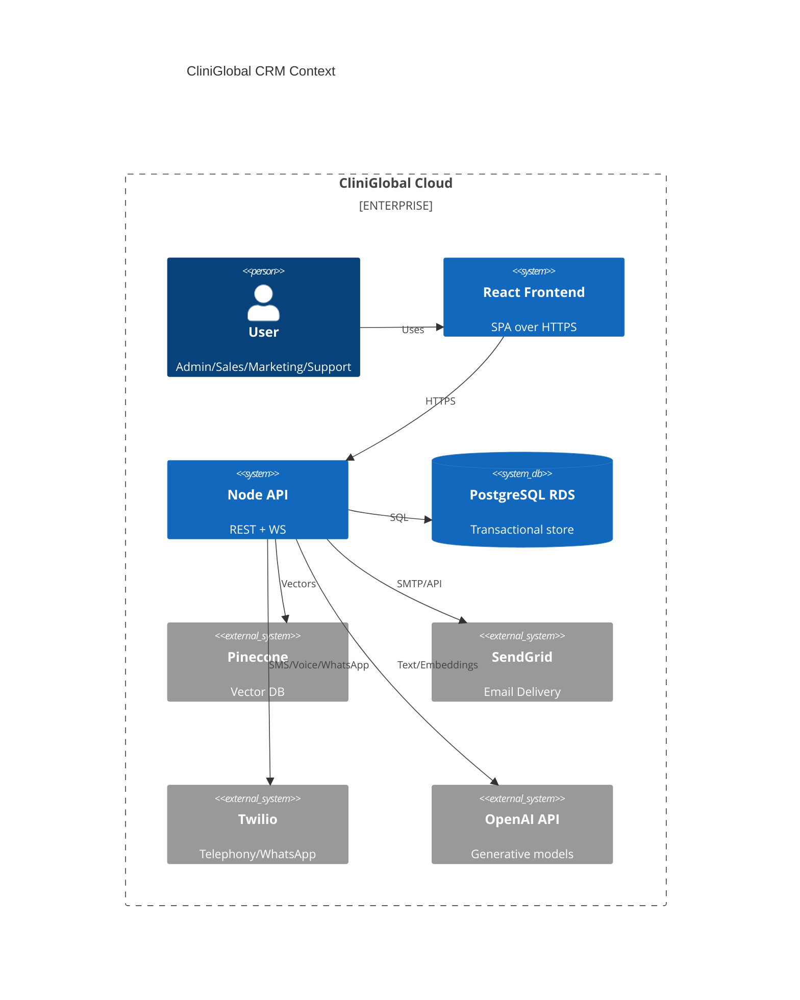
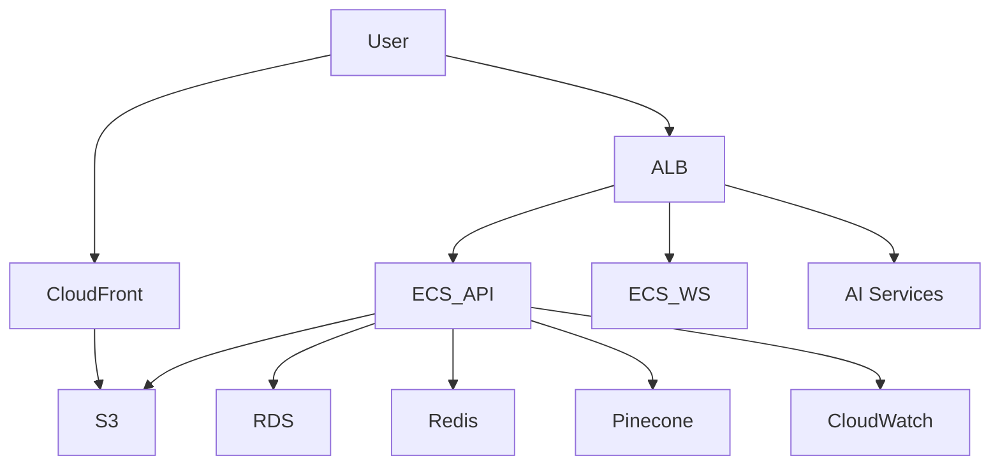

# Architecture - CliniGlobal AI CRM

## Components
- Frontend (React + Vite + TypeScript): Responsive UI, role-aware navigation, dashboards, Kanban pipeline, chat widget, voice notes
- Backend (Node.js + Express + TypeScript): REST API, WebSocket Gateway, RBAC, integrations (SendGrid, Twilio), data access, PDF/Excel exports
- AI Services (FastAPI): Lead scoring, sentiment analysis, predictive forecasting, NLP semantic search, personalization, transcription
- Data Layer: PostgreSQL RDS (with pgcrypto, optionally pgvector), Redis cache, S3 for attachments, Pinecone for semantic vectors
- Observability: CloudWatch, OpenTelemetry traces, centralized audit logs

## Data Flow
1. User authenticates via OAuth2 or email+password + MFA. Backend issues JWT.
2. Frontend uses JWT to call REST. Websocket for real-time updates.
3. Backend accesses Postgres for CRUD; caches common reads in Redis.
4. AI calls proxied via Backend to dedicated FastAPI services with service-level auth.
5. Embeddings are created and stored in Pinecone; metadata keys link back to Postgres entities.
6. Exports and reports generated server-side and stored in S3.

## Security
- Short-lived access tokens, rotating refresh tokens
- AES-256-GCM app-layer encryption for PII fields
- Row-level auditing and IP/device tracking
- Feature-flagged access and data segmentation by organization/tenant

## Diagrams

### Context Diagram

### Deployment Diagram
